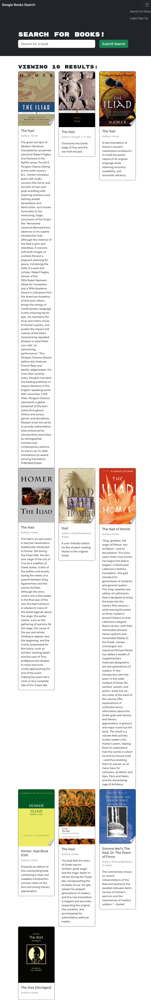
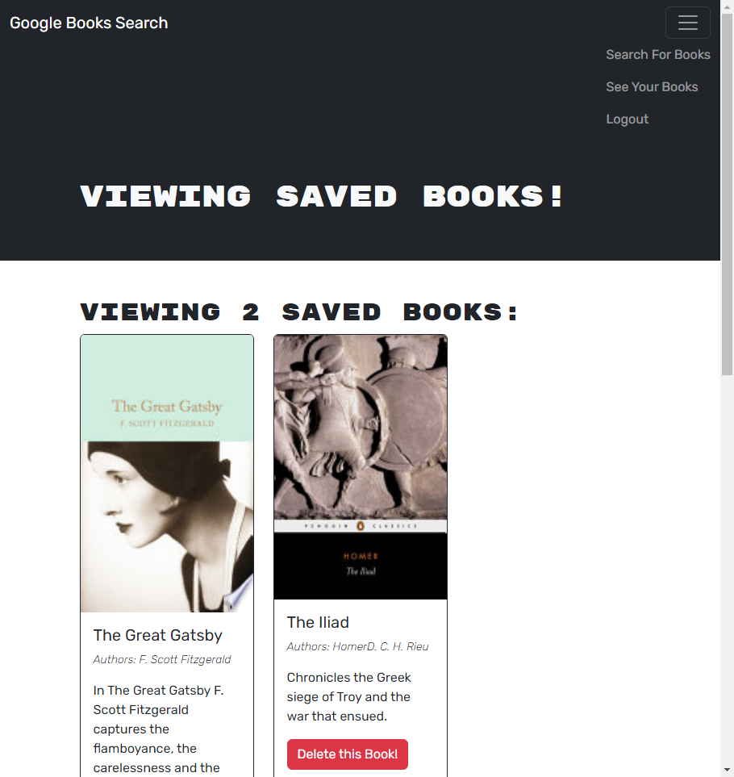

# MERN: Book Search Engine


## Description

This is an example of a book search engine that has been refactured from a RESTful API to a GraphQL API built with ApolloServer. It is built using MERN stack with a React front end, MongoDB database, and Node.js/Express.js server and API. Check the appropriate files and file structure to compare and contrast utility from a typical RESTful API with this ApolloServer based MERN stack.

The site allows users to search for books through Google Books API, which they can save books they're interested in to their saved books page after registering/login. Users can remove saved books in case they added the wrong book or is no longer needed. When users search a book, a max of 10 results is shown to choose from to select from, so refining the search query may be necessary to find a specific book/edition. The book card details presented show a book’s title, author, description, image, and a link to that book on the Google Books site.

## Table of Contents

- [Installation](#installation)
- [Usage](#usage)
- [Contribution](#contribution)
- [Technologies](#technologies)
- [Questions](#questions)
- [License](#license)

## Installation

1. To install just clone this repo:

```
git clone git@github.com/hculp/book-search-engine
```

2. Install all required packages with npm:

```
npm i
```

3. To run the app locally, just use
   `npm run develop`.

## Usage

To test the production side site, click on this Heroku [link](https://floating-atoll-38325-3c75ac88d150.herokuapp.com/).

Create an account to test the features.

This is a picture of the homepage when the user opens the app.


This is a picture demonstrating a search query using book The Iliad.


This is an example image of the saved books page after a user has logged in and saved some books they searched.


## Contribution

Contribution falls under open MIT license.

## Technologies

- React
- GraphQL
- MongoDB and Mongoose
- Node.js
- Express.js
- Apollo Server
- JWT
- bcrypt
- Vite
- Bootstrap
- Google Books API

## Questions

Send any questions or feedback to the following contacts:

- GitHub: [https://github.com/hculp](https://github.com/hculp)
- Email: [howacul@gmail.com](mailto:howacul@gmail.com)

## License

    Copyright (C) 2023 Houston Culpepper.

    Distributed under the MIT License.

[Link to MIT license](https://choosealicense.com/licenses/mit)
